# Ex-08-Data-Visualization-

## AIM

To Perform Data Visualization on the given dataset and save the data to a file.

# Explanation

Data visualization is the graphical representation of information and data. By using visual elements like charts, graphs, and maps, data visualization tools provide an accessible way to see and understand trends, outliers, and patterns in data.

# ALGORITHM

### STEP 1

Read the given Data

### STEP 2

Clean the Data Set using Data Cleaning Process

### STEP 3

Apply Feature generation and selection techniques to all the features of the data set

### STEP 4

Apply data visualization techniques to identify the patterns of the data.

## Data Pre-Processing

```
import pandas as pd
import numpy as np
import matplotlib.pyplot as plt
import seaborn as sns
df=pd.read_csv("/content/Superstore.csv",encoding="ISO-8859-1")
df
df.isnull().sum()
df.info()
df.describe()
```

## Which Segment has Highest sales?

```
sns.lineplot(x="Segment",y="Sales",data=df,marker='o')
plt.title("Segment vs Sales")
plt.xticks(rotation = 90)
plt.show()

sns.barplot(x="Segment",y="Sales",data=df)
plt.xticks(rotation = 90)
plt.show()
```

## Which City has Highest profit?

```
df.shape
df1 = df[(df.Profit >= 60)]
df1.shape

plt.figure(figsize=(30,8))
states=df1.loc[:,["City","Profit"]]
states=states.groupby(by=["City"]).sum().sort_values(by="Profit")
sns.barplot(x=states.index,y="Profit",data=states)
plt.xticks(rotation = 90)
plt.xlabel=("City")
plt.ylabel=("Profit")
plt.show()
```

## Which ship mode is profitable?

```
sns.barplot(x="Ship Mode",y="Profit",data=df)
plt.show()
```

```
sns.lineplot(x="Ship Mode",y="Profit",data=df)
plt.show()
```

## Sales of the product based on region.

```
states=df.loc[:,["Region","Sales"]]
states=states.groupby(by=["Region"]).sum().sort_values(by="Sales")
sns.barplot(x=states.index,y="Sales",data=states)
plt.xticks(rotation = 90)
plt.xlabel=("Region")
plt.ylabel=("Sales")
plt.show()
```

```
df.groupby(['Region']).sum().plot(kind='pie', y='Sales',figsize=(6,9),pctdistance=1.7,labeldistance=1.2)
```

## Find the relation between sales and profit.

```
df["Sales"].corr(df["Profit"])
```

```
df_corr = df.copy()
df_corr = df_corr[["Sales","Profit"]]
df_corr.corr()
```

```
sns.pairplot(df_corr, kind="scatter")
plt.show()
```

### Segment

```
grouped_data = df.groupby('Segment')[['Sales', 'Profit']].mean()
# Create a bar chart of the grouped data
fig, ax = plt.subplots()
ax.bar(grouped_data.index, grouped_data['Sales'], label='Sales')
ax.bar(grouped_data.index, grouped_data['Profit'], bottom=grouped_data['Sales'], label='Profit')
ax.set_xlabel('Segment')
ax.set_ylabel('Value')
ax.legend()
plt.show()
```

### City

```
grouped_data = df.groupby('City')[['Sales', 'Profit']].mean()
# Create a bar chart of the grouped data
fig, ax = plt.subplots()
ax.bar(grouped_data.index, grouped_data['Sales'], label='Sales')
ax.bar(grouped_data.index, grouped_data['Profit'], bottom=grouped_data['Sales'], label='Profit')
ax.set_xlabel('City')
ax.set_ylabel('Value')
ax.legend()
plt.show()
```

### States

```
grouped_data = df.groupby('State')[['Sales', 'Profit']].mean()
# Create a bar chart of the grouped data
fig, ax = plt.subplots()
ax.bar(grouped_data.index, grouped_data['Sales'], label='Sales')
ax.bar(grouped_data.index, grouped_data['Profit'], bottom=grouped_data['Sales'], label='Profit')
ax.set_xlabel('State')
ax.set_ylabel('Value')
ax.legend()
plt.show()
```

### Segment and Ship Mode

```
grouped_data = df.groupby(['Segment', 'Ship Mode'])[['Sales', 'Profit']].mean()
pivot_data = grouped_data.reset_index().pivot(index='Segment', columns='Ship Mode', values=['Sales', 'Profit'])
# Create a bar chart of the grouped data
fig, ax = plt.subplots()
pivot_data.plot(kind='bar', ax=ax)
ax.set_xlabel('Segment')
ax.set_ylabel('Value')
plt.legend(title='Ship Mode')
plt.show()
```

### Segment, Ship mode and Region

```
grouped_data = df.groupby(['Segment', 'Ship Mode','Region'])[['Sales', 'Profit']].mean()
pivot_data = grouped_data.reset_index().pivot(index=['Segment', 'Ship Mode'], columns='Region', values=['Sales', 'Profit'])
sns.set_style("whitegrid")
sns.set_palette("Set1")
pivot_data.plot(kind='bar', stacked=True, figsize=(10, 5))
plt.xlabel('Segment - Ship Mode')
plt.ylabel('Value')
plt.legend(title='Region')
plt.show()
```

# OUPUT

## Data Pre-Processing


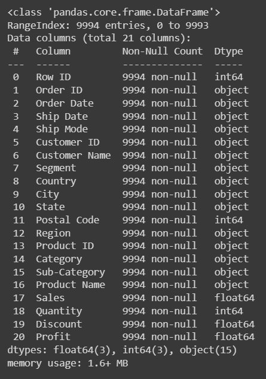

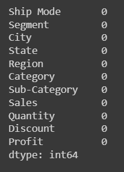

## Which Segment has Highest sales?


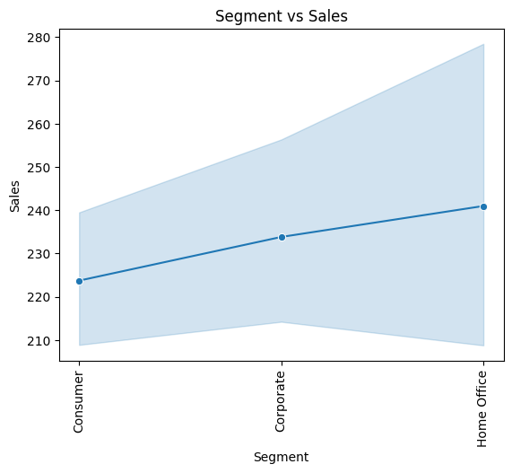

## Which City has Highest profit?


## Which ship mode is profitable?

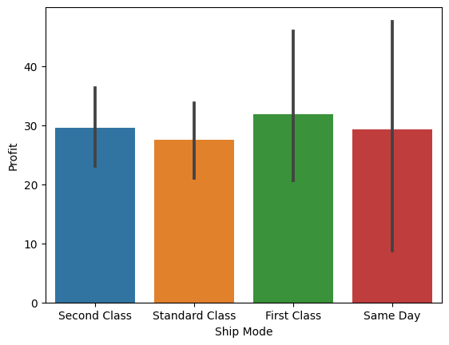

## Sales of the product based on region.

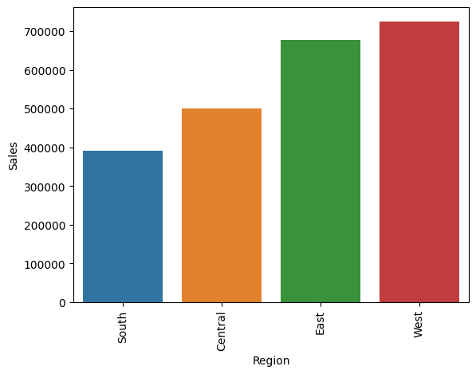


## Find the relation between sales and profit

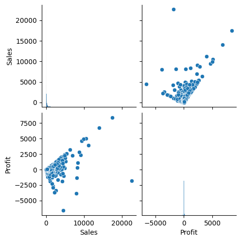

## Find the relation between sales and profit based on the following category.

### Segment

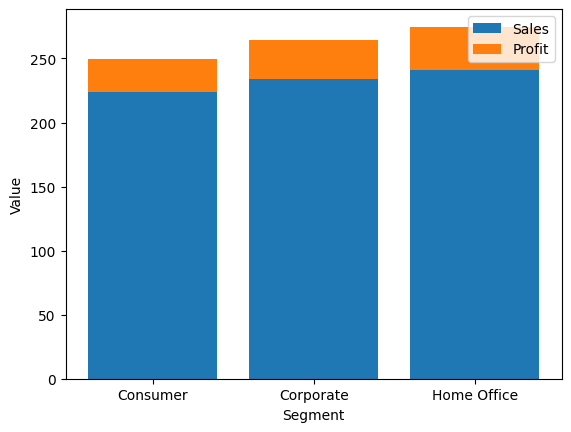

### City

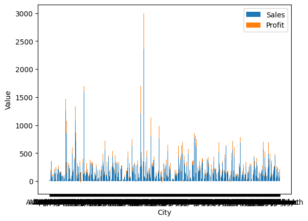

### States

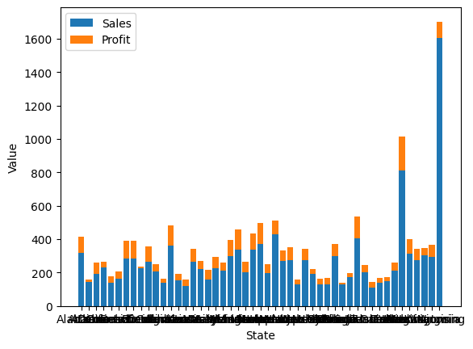

### Segment and Ship Mode

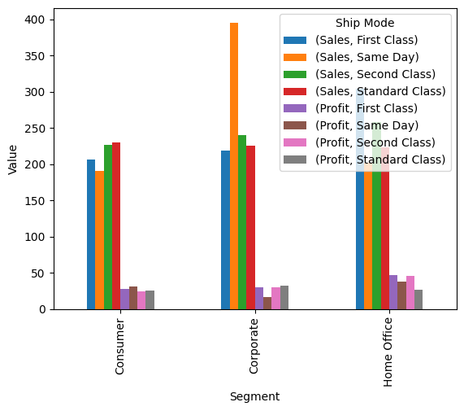

### Segment, Ship mode and Region

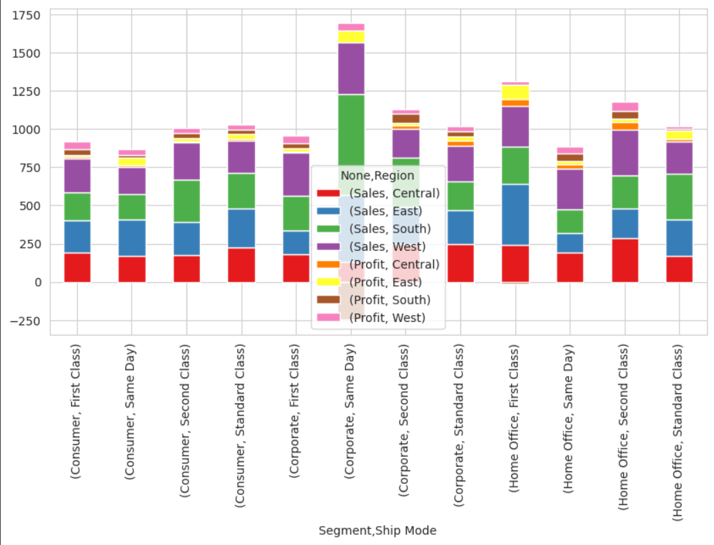

# Result:

Thus, Data Visualization is performed on the given dataset and save the data to a file.
